# Hey there, currently a beginner but soon will be a GAWD!!

 

###

<h1 align="left">My Boring Stats:</h1>

###

<!-- GitHub Stats -->

  

<!-- Top Languages -->

  

<!-- GitHub Streak -->

<!--START_SECTION:waka-->
<!--END_SECTION:waka-->

###

<h1 align="left">Languages and Tools:</h1>

###

  
  
  
  
  
  
  
  
  
  
  
  
  

###
